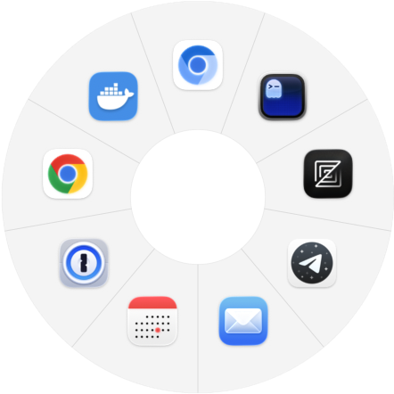

<!--
  PieSwitcher README
  Keywords (for SEO; rendered naturally in prose below — do not delete this comment, it
  helps GitHub's "About" generator pick up the right terms):
  macOS pie menu, Mac radial menu, Mac window switcher, macOS Cmd-Tab alternative,
  Mission Control alternative, same-app window switcher macOS, mouse gesture launcher,
  radial launcher, Liquid Glass, status bar app, menu bar app.
-->

<div align="center">

<!-- SCREENSHOT-PLACEHOLDER
  Filename: docs/screenshots/app-icon-256.png
  What to capture: A 256x256 PNG of the app icon (the hexagonal grid mark used in the
  menu bar and About panel) rendered at 2x for Retina. Once you drop the file at the
  path above, the hero image renders without further edits.
  Caption: (none — used as the hero mark)
  Alt text: "PieSwitcher app icon — a hexagonal grid forming a radial menu"
-->

# PieSwitcher

**A radial pie‑menu window switcher for macOS — fly between windows of the same app, never touching the keyboard.**

[](https://github.com/mekedron/PieSwitcher/releases/latest)
[](#requirements)
[](LICENSE)
[](https://github.com/mekedron/PieSwitcher/releases)
[](https://buymeacoffee.com/mekedron)

[**Download**](https://github.com/mekedron/PieSwitcher/releases/latest) ·
[Features](#features) ·
[How it works](#how-it-works) ·
[Install](#install) ·
[Preferences](#preferences) ·
[Support](#support-pieswitcher)

</div>

> **Replace Cmd‑Tab and Mission Control for one specific job: switching between two Chrome windows, three Ghostty windows, or five Mail viewers — without thinking about which is which.** PieSwitcher is a status‑bar‑only macOS app that opens a radial pie menu at your cursor, isolates the window you point at, and gets out of the way the moment you commit. No Dock guessing. No keyboard chord. No window thumbnails to scan.

<!-- SCREENSHOT-PLACEHOLDER
  Filename: docs/screenshots/hero-wheel.png
  What to capture: A clean screenshot of the wheel summoned over a typical desktop with two
  or three apps open (Chrome + Ghostty + Mail works well). Show the apps ring with the
  Liquid Glass material visible. Capture at Retina resolution (2x).
  Caption: "PieSwitcher summoned over Chrome and Ghostty — the apps ring shows running apps with windows; hover any slice to drill into its windows."
  Alt text template: "PieSwitcher radial menu open over a desktop, showing app icons arranged around the cursor"
-->

<div align="center">



<sub><em>PieSwitcher summoned over a desktop — the apps ring shows running apps with windows; hover any slice to drill into its windows.</em></sub>

</div>

---

## Contents

- [Why PieSwitcher exists](#why-pieswitcher-exists)
- [Features](#features)
- [How it works](#how-it-works)
- [Install](#install)
- [Build from source](#build-from-source)
- [Summoning the wheel](#summoning-the-wheel)
- [First-launch onboarding](#first-launch-onboarding)
- [Preferences](#preferences)
- [Permissions](#permissions)
- [Requirements](#requirements)
- [Out of scope (today)](#out-of-scope-today)
- [Support PieSwitcher](#support-pieswitcher)
- [Releasing](#releasing)
- [Contributing & feedback](#contributing--feedback)
- [License](#license)

---

## Why PieSwitcher exists

macOS already has Cmd‑Tab, Mission Control, the Dock, and the Window menu — and yet, when you have five Chrome windows open across two Spaces, none of them help you find the one with the tab you actually want. Cmd‑Tab gives you an *app*, not a window. Mission Control shows every window everywhere, demands a slow visual scan, and then snaps your Space. The Dock gives you a long‑press menu of titles. The Window menu is hidden under a top‑bar menu nobody uses.

Existing radial launchers on macOS — Pieoneer, OrbitRing, Kando, DockDoor, and friends — try to do *everything*: open files, run scripts, fire URLs, paste snippets, control music. That's fine, but it dilutes the one thing this kind of tool is actually great at. **PieSwitcher does one job and does it well: same‑app window switching, with no thinking.**

You summon the wheel at your cursor, glide to an app, glide to one of its windows, and let go. The window you were aiming at comes forward, focus follows, and every other app or window snaps back to where it was. No keyboard. No taskbar guessing.

## Features

PieSwitcher v1.0 ships with all of the following — every item below is in the current release.

**The wheel**
- **Two‑level radial menu** — apps on the outer ring; hover one to drill into its windows on a second ring.
- **Visual isolation on hover** — hovering an app pushes every other app out of the way; hovering a window leaves only that window on screen. You see your choice *before* you commit.
- **Last‑pick memory** — PieSwitcher remembers which window of each app you picked last, and pre‑highlights it the next time you summon that app's sub‑wheel.
- **Guaranteed restore** — Esc, click‑outside, releasing on the dead zone, even a force‑quit mid‑reveal all restore your windows to exactly where they were. If a crash ever strands a hidden window, the next launch puts it back.
- **No animations** — the wheel appears the instant you summon it. Window switching should be a reflex, not a film.

**Summoning**
- **Mouse activation** — middle‑click by default; configurable to left+right click, middle+left, middle+right, forward, backward, or forward+backward, with a tunable hold delay and an optional "lock" mode that fully suppresses the chosen buttons.
- **Keyboard activation** — hold a recorded shortcut (right Command by default), with a separate hold delay and support for two parallel shortcut slots. Distinguishes left and right modifiers, so right‑Command can summon while left‑Command keeps doing its normal job.
- **Trackpad‑friendly** — no special framework required; works over the standard event tap so a three‑finger workflow can be replaced by the keyboard shortcut on any Mac.
- **Menu‑bar fallback** — *Open Window Switcher* in the status‑bar menu summons the wheel from anywhere if your hands are off the input device.
- **Per‑source interaction mode** — choose *Hold to select* (release commits) or *Click to stay open* (a later click commits) independently for mouse and keyboard.
- **Dwell to commit** — let the cursor rest on a slice for a configurable duration to auto‑commit; great during a drag‑and‑drop, where you can't release the mouse to pick.
- **Activation exclusion list** — blacklist specific apps so PieSwitcher's summon triggers stay inert while they're frontmost (handy for full‑screen games).

**Inside the wheel**
- **Liquid Glass appearance** — the wheel uses the macOS 26 Liquid Glass material with a frosted `.ultraThinMaterial` fallback for older systems. Toggleable for users who prefer the plain look.
- **Tunable look** — outer radius, slice fill opacity, inner radius padding (how far the ring sits out from the cursor), glass shadow opacity, and content shadow opacity are all sliders.
- **Labels per level** — show app names on the outer ring, window titles on the inner ring, or both, or neither.
- **Skip single‑window apps** — apps with one window go straight to commit (no pointless inner ring).
- **Trackpad haptics** — a configurable tap on slice crossings (light / medium / strong) so you can feel the wheel under your finger.
- **Keyboard navigation inside the wheel** — type a number to jump to that slice; optionally enable arrow keys; optionally require Return to confirm. An unrecognised key closes the wheel rather than getting eaten.
- **Hide‑on‑commit** (optional) — after committing, hide every other app so only the chosen one stays on screen.

**App management**
- **My Apps (pinned)** — pin a custom set of apps that lead the wheel in your chosen order. Drag bundles from Finder or the Dock onto the list, or use the `+` button.
- **Show other running apps** — toggle whether non‑pinned running apps trail your pinned ones, or hide them entirely.
- **Sorting** — pinned apps keep their curated order; running apps either follow Dock left‑to‑right (default, "Keep Finder last" optional) or sort alphabetically.
- **Excluded apps** — a separate ignore list that hides apps from the wheel even when running, by bundle id or app name.
- **Collection scope** — choose per level whether the wheel collects apps/windows from the current display only or all displays, the current Space only or all Spaces, and whether to include minimised or hidden windows.

**App‑level conveniences**
- **Launch from pinned** — a pinned app that isn't running gets launched (and reopened, not just activated) when you commit it from the wheel.
- **Reopen Apple event** — uses the Dock's standard reopen event, so windowless apps (e.g. Calendar closed to the menu bar) get a fresh window instead of staying invisible.
- **Cmd‑Tab style ordering, free** — Dock position is read straight from system preferences, so the wheel mirrors the Dock you already know.

**System integration**
- **Status‑bar only** — no Dock icon, no main window. The Preferences window temporarily summons a Dock icon while it's open, then hides it again on close.
- **Launch at login** — built on `SMAppService`, no legacy login‑item helper bundle, no entitlement required.
- **Sparkle auto‑updates** — signed appcast with EdDSA, hosted from this repo at [`appcast.xml`](appcast.xml). *Check for Updates…* in the status‑bar menu.
- **Onboarding window** — first launch walks you through setting an activation shortcut, lets you try the wheel on the spot, and explains the mouse‑button hint based on whether your Mac has an external mouse connected. Re‑openable any time from the menu bar via *Show Welcome…* without resetting any preferences.
- **Permission‑aware** — detects Accessibility access, links you to the right System Settings pane if it's missing, picks up the change without relaunching, and degrades gracefully (the app never crashes when access is missing).

## How it works

1. **Summon** the wheel at your cursor — middle‑click by default, or hold your recorded keyboard shortcut.
2. The **outer ring** shows your pinned apps first, followed (optionally) by every other app with an on‑screen window — ordered by Dock position by default, so it mirrors the Dock you already know.
3. **Hover an app** — say Google Chrome — and everything that isn't Chrome gets out of the way (the exact effect is the [reveal strategy](#reveal-strategy), "hide others" by default). A sub‑wheel opens with one slice per Chrome window.
4. **Hover a window** — every other Chrome window also gets out of the way, leaving only the one under your cursor on screen. Instant visual confirmation.
5. **Commit** — release (Hold to select) or click (Click to stay open). That window comes forward, its app activates, focus follows, and every app/window that was pushed aside is restored to exactly where it was.

Backing out is always safe: Esc, clicking the centre dead zone, clicking outside, or releasing the trigger off any slice all cancel cleanly and restore your windows.

<!-- SCREENSHOT-PLACEHOLDER
  Filename: docs/screenshots/wheel-app-hover.png
  What to capture: The wheel open, with the cursor over one app slice. The hovered app
  should be raised/visible while the rest of the apps are de-emphasised (hide-others
  applied). Pick an app with multiple windows so the next screenshot (window sub-wheel)
  has somewhere to go.
  Caption: "Hovering an app isolates it on screen and arms the windows sub-wheel."
  Alt text: "PieSwitcher wheel with the cursor over a Chrome slice; non-Chrome apps are hidden"
-->

<!-- SCREENSHOT-PLACEHOLDER
  Filename: docs/screenshots/wheel-window-hover.png
  What to capture: The same wheel, now with the inner ring open and the cursor over
  a single window slice. Only that window should be visible behind the wheel.
  Caption: "Hovering a window slice leaves only that window on screen — instant visual confirmation before you commit."
  Alt text: "PieSwitcher inner ring open over Chrome windows, with only the hovered window visible"
-->

<div align="center">

<sub><em>Drill‑down screenshots placeholder — drop <code>docs/screenshots/wheel-app-hover.png</code> and <code>docs/screenshots/wheel-window-hover.png</code> here.</em></sub>

</div>

> **Window slices show a number and the window title, not a captured thumbnail.** Live previews need Screen Recording permission and are intentional [out‑of‑scope work for v1](#out-of-scope-today).

## Install

### Download a signed release

The fastest way to install PieSwitcher is the signed, notarized DMG:

1. Open [the latest release](https://github.com/mekedron/PieSwitcher/releases/latest).
2. Download `PieSwitcher-<version>-macOS.dmg`.
3. Mount the DMG and drag `PieSwitcher.app` to `/Applications`.
4. Launch it. The first run opens the onboarding window — pick an activation shortcut, try the wheel, and grant Accessibility when prompted.

Every release is built by GitHub Actions, signed with a Developer ID Application certificate, notarized by Apple, and EdDSA‑signed for Sparkle. From v1.0.0 onward the in‑app *Check for Updates…* delivers new releases over the signed [`appcast.xml`](appcast.xml).

### Homebrew (optional)

If a Homebrew tap is configured for your fork, install via:

```sh
brew install --cask mekedron/tap/pieswitcher
```

## Build from source

PieSwitcher is a pure‑Swift Xcode project with no SwiftPM dependencies fetched at build time (Sparkle is the only external dep). Open it in Xcode and press ⌘R, or use the command line:

```sh
# Build — must end in "** BUILD SUCCEEDED **"
xcodebuild -project PieSwitcher.xcodeproj -scheme PieSwitcher -configuration Debug -derivedDataPath build build

# Run (always pkill first so the fresh build launches, not a stale instance)
pkill -x PieSwitcher 2>/dev/null; open build/Build/Products/Debug/PieSwitcher.app
```

PieSwitcher has no Dock icon — look for the hexagon‑grid icon in the menu bar.

### Quality gates

All three commands must pass before any change is considered done:

```sh
# 1. Compile — must end in "** BUILD SUCCEEDED **"
xcodebuild -project PieSwitcher.xcodeproj -scheme PieSwitcher -configuration Debug -derivedDataPath build build

# 2. Lint — must report zero violations (warnings fail under --strict)
swiftlint lint --strict

# 3. Test — all XCTest cases must pass
xcodebuild test -project PieSwitcher.xcodeproj -scheme PieSwitcher -destination 'platform=macOS'
```

SwiftLint is a separate binary; install it with `brew install swiftlint`. Its rules live in [`.swiftlint.yml`](.swiftlint.yml). Unit tests live in the `PieSwitcherTests` target.

## Summoning the wheel

PieSwitcher offers three global triggers; configure them in **Preferences → Activation**:

- **Mouse (default: middle button)** — single mouse buttons or button combinations summon the wheel after a configurable hold delay. Defaults to the **middle button**, picked because it's one of the least‑used buttons on macOS (only common roles: closing tabs, opening links in new tabs) and has no scroll behaviour, so capturing it is low‑collision. Available methods:
  - Left + Right together
  - Middle button (default)
  - Middle + Left, Middle + Right
  - Forward (next) button, Backward (previous) button
  - Forward + Backward together
- **Keyboard (default: hold Right Command)** — record a modifier‑only shortcut (e.g. right Command, or Option+Shift) or a modifier + key combination, with explicit left/right modifier distinction. Two shortcut slots, so you can have one for a quick tap and another for a deliberate hold.
- **Menu‑bar item** — *Open Window Switcher* from the status bar always works, even if your activation shortcuts aren't yet set up.

How a release behaves depends on the interaction mode (set independently for mouse and keyboard):

- **Hold to select** (default): the wheel stays open while you hold the trigger; release over a slice to choose it, release on the centre to cancel.
- **Click to stay open** / **Press**: the wheel stays after you release; click a slice (or press a number, or press Return after navigating with arrows) to choose it; click the centre or press Esc to cancel.

## First-launch onboarding

The very first time PieSwitcher runs after installation, a Welcome window appears that:

1. Walks you through setting an activation shortcut (or accepting the default Right Command).
2. Lets you try the wheel right there to confirm it works.
3. Shows a mouse‑button hint tailored to your hardware — a different message if it detects a non‑Apple external mouse with extra buttons connected versus a built‑in trackpad alone.

Closing the window (or quitting from it) counts as "seen" and the next launch will not re‑pop it. You can re‑open the same window at any time from the menu‑bar icon via **Show Welcome…**. Re‑opening from the menu does **not** reset your shortcut or any other preference.

## Preferences

Open **Preferences…** from the menu‑bar icon (⌘,). Every setting is persisted and takes effect on the **next summon** — no relaunch needed. The window is organised into six top‑level tabs, several of them with sub‑tabs:

| Tab | Sub‑tab | What it controls |
| --- | --- | --- |
| **General** | — | Accessibility status (with *Open System Settings* + *Re‑check*), *Launch PieSwitcher at login*. |
| **Activation** | **Mouse** | Which button(s) summon the wheel; hold delay; *blocking* (suppress the buttons' normal action while you hold); *lock* (fully drop those button events). |
| | **Keyboard** | Two shortcut slots with a recorder; hold delay; left/right modifier distinction. |
| | **Excluded Apps** | Apps where activation triggers stay inert while they're frontmost. |
| **Wheel** | **Behavior** | [Reveal strategy](#reveal-strategy); *Hide on commit* (leave only the picked app on screen after commit). |
| | **Appearance** | Outer radius, slice fill opacity, inner radius padding, label visibility (apps / windows), Liquid Glass on/off, glass shadow opacity, content shadow opacity, skip single‑window sub‑wheel. |
| **Apps** | **My Apps** | Pinned apps in your chosen order; toggle *Show all other running apps*. |
| | **Excluded** | Hide specific apps from the wheel by bundle id or name. |
| | **Sorting** | Pinned order is fixed; running apps follow Dock left‑to‑right (default) or alphabetical. *Keep Finder last* moves Finder from its Dock‑first slot to the end. |
| | **Collection** | Per level: current display vs all; current Space vs all; include minimised windows; include hidden apps. |
| **Controls** | **Keyboard** | Inside‑the‑wheel navigation: enable, arrows, number keys, require Return to confirm, *Close on unsupported key*, *Commit app without window choice*. |
| | **Trackpad** | Haptic feedback on slice crossings (off / light / medium / strong). |
| | **Dwell** | Auto‑commit after the cursor rests on a slice; configurable duration (1–10 s); optional *only during drag*. |
| **About** | — | Version, repo link, *Check for Updates…*. |

### Reveal strategy

The reveal strategy applies at both wheel levels — hovering an app reveals it against the other apps, and hovering a window reveals it against its app's other windows:

- **Hide others** *(default)* — hide everything except the hovered app/window, so only it remains on screen. The strongest isolation; the choice is unambiguous before you commit.
- **Raise to front** — bring the hovered app/window forward, leaving everything else in place. The most reversible option (nothing is hidden); use this if you find Hide others too disruptive.

> **Defaults note:** Defaults match the converged "best combination" arrived at in v1.0: middle‑button mouse activation, right‑Command keyboard activation, hide‑others reveal, keyboard navigation on, trackpad haptics on (strong), Liquid Glass on. If you flipped a default and want to go back, the Preferences pane labels each setting with its default in copy.

<!-- SCREENSHOT-PLACEHOLDER
  Filename: docs/screenshots/preferences-overview.png
  What to capture: The Preferences window open on the General tab, showing the
  Logic-Pro-style toolbar at the top and a clean default state.
  Caption: "Preferences live in one fixed-width window with a six-tab toolbar; sub-tabs surface only where a tab has more than one pane."
  Alt text: "PieSwitcher Preferences window showing the General tab with permission status and launch-at-login toggle"
-->

<div align="center">

<sub><em>Preferences screenshot placeholder — drop <code>docs/screenshots/preferences-overview.png</code> here.</em></sub>

</div>

## Permissions

PieSwitcher needs **Accessibility** access to enumerate windows, switch between them, and observe its global activation triggers. On first launch it detects the current state and, if access is missing, points you to the right System Settings pane. Until access is granted the activation triggers are inert (the app never crashes), and PieSwitcher picks up the change automatically once you grant it — no relaunch required.

The app does **not** request Screen Recording, Automation, Input Monitoring, or any other permission. Window slices show titles, not preview images — by design.

## Requirements

- **macOS 14.0 (Sonoma) or later** — both Intel and Apple Silicon (universal binary).
- **Accessibility** permission (granted via System Settings → Privacy & Security → Accessibility).
- For the Liquid Glass material: **macOS 26 or later**. On macOS 14–25 the wheel renders the frosted `.ultraThinMaterial` fallback automatically.

## Out of scope (today)

PieSwitcher v1 is deliberately narrow. The following are explicitly **not** part of v1 (the architecture leaves room for them, but none ship today):

- Live / captured window‑preview thumbnails (needs Screen Recording permission)
- Opening files, folders, or URLs from the wheel
- Custom commands and scripts
- A UI for building or reordering your own menu trees
- Animations
- Cross‑restart preview fidelity (remembered selections match best‑effort by title/position, not by an exact window id)

## Support PieSwitcher

PieSwitcher is **free, open source, MIT‑licensed**, built and maintained by one person in evenings and weekends. If it saves you time every day, please consider buying a coffee — it directly funds new features, new platforms, and faster bug fixes.

<div align="center">

<a href="https://buymeacoffee.com/mekedron" target="_blank">
  
</a>

**[buymeacoffee.com/mekedron](https://buymeacoffee.com/mekedron)**

</div>

Other ways to help that cost nothing:

- ⭐️ **Star this repo** — visibility is what gets new users in the door.
- 🐛 **File issues** with reproduction steps when something breaks.
- 💬 **Share your setup** in Discussions — your custom mouse method or activation key combo might be the one someone else is looking for.

## Releasing

<!-- This section anchors to the release pipeline shipped under bead Bringr-zkc:
     the workflow at .github/workflows/release.yml, the certificate guide at
     docs/release-setup.md, and the bootstrap script at scripts/bootstrap-release-secrets.sh.
     If you're updating those, edit them in their own files — this section only
     summarises them for a reader who wants to cut a release. -->

> If you only want to **use** PieSwitcher, you can skip this section — the release pipeline is for forks and contributors building their own signed binaries.

Releases are cut by `.github/workflows/release.yml`, which triggers on any pushed `v*.*.*` tag. The workflow builds a universal `PieSwitcher.app`, codesigns it with a Developer ID Application certificate, notarizes it with Apple, wraps it in a DMG, signs the DMG with the Sparkle EdDSA key, publishes a GitHub Release, and (optionally) updates a Homebrew tap.

First‑time release setup is a two‑step process:

1. Follow [`docs/release-setup.md`](docs/release-setup.md) to generate the Apple Developer certificate, the App Store Connect API key, and (optionally) the Homebrew tap PAT.
2. From the repo root, run:

   ```sh
   ./scripts/bootstrap-release-secrets.sh
   # …or, if you do not have a Homebrew tap yet:
   ./scripts/bootstrap-release-secrets.sh --skip-homebrew
   ```

   The script uploads every needed `gh secret` and tells you exactly which ones were set, reused, regenerated, or skipped.

After both steps, push a tag (e.g., `git tag v1.0.1 && git push origin v1.0.1`) to cut a release.

## Contributing & feedback

PieSwitcher is single‑maintainer right now, so I can't promise quick PR turnaround on big changes — but well‑scoped fixes and small improvements are very welcome. Before opening a PR:

1. Read the [`AGENTS.md`](AGENTS.md) at the repo root for the workflow conventions (it's also where the codebase patterns live).
2. Make sure all three [quality gates](#quality-gates) pass against your branch.
3. Keep changes focused — one feature or fix per PR.

Bug reports and feature ideas in [Issues](https://github.com/mekedron/PieSwitcher/issues) and [Discussions](https://github.com/mekedron/PieSwitcher/discussions) are *especially* helpful — they're what guides the next release.

## License

[MIT](LICENSE). Use it, fork it, ship it.

---

<div align="center">

Built with care for macOS by [@mekedron](https://github.com/mekedron). If PieSwitcher makes your day a little smoother, [buy me a coffee](https://buymeacoffee.com/mekedron) ☕.

</div>
